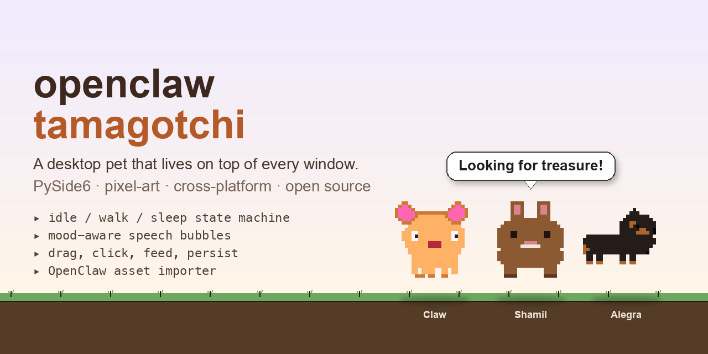
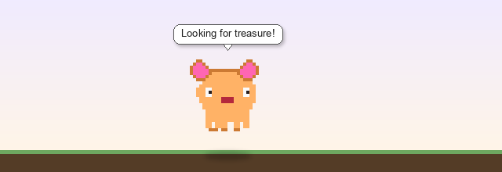
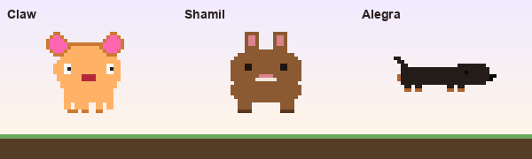
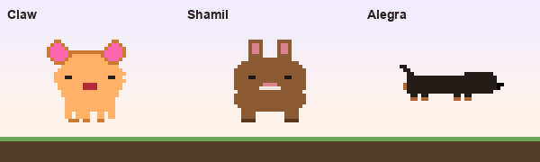
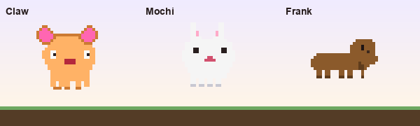
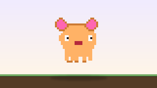
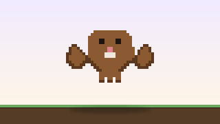
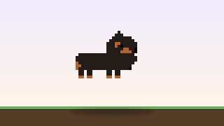

<p align="center">
  
</p>

# openclaw-tamagotchi

A desktop pet that lives on top of every other window. Inspired by the
[OpenClaw](https://github.com/openclaw/openclaw) project (an open-source
re-implementation of *Capt. Claw*) and the visual style of
[codex-pets.net](https://codex-pets.net/).

The pet idles, walks around the bottom of your screen, sleeps when tired,
gets hungry, complains in speech bubbles, lets you drag it anywhere, and
remembers how it was feeling the last time you quit.

<p align="center">
  
</p>

## In motion

| Idle | Walk | Sleep |
| :---: | :---: | :---: |
|  |  |  |
| 8 frames @ 6 fps | 6 frames @ 12 fps | 4 frames @ 3 fps |

## Pets included

Three pets ship in the box. Pick one with `--pet <name>`.

<p align="center">
  
</p>

| | Pet | Personality | Run with |
| :---: | --- | --- | --- |
|         | **Claw** — pirate cat                 | dreamy, nostalgic, gently chaotic     | `tamagotchi --pet claw`      |
|     | **Shamil** — brown bunny with tall ears | bouncy, snack-obsessed, ears for days | `tamagotchi --pet rabbit`    |
|  | **Alegra** — black-and-tan dachshund  | long girl, slow brain, expert napper  | `tamagotchi --pet dachshund` |

Each pet has its own sprite art, its own `pet.yaml` (different walk speed,
sleep timer, hunger curve), and its own dialogue book — so they actually
*feel* different running around your screen, not just look different.

> Want your own creature? See [HOWTO.md → Adding your own pet](HOWTO.md#adding-your-own-pet).
> The whole pet is just a folder.

## Features

- **Frameless, transparent, always-on-top window** — no taskbar entry, no dock icon (macOS optional)
- **State machine** — idle ↔ walk ↔ sleep, driven by stats and timers
- **Hunger / energy / happiness** stats that decay over time and trigger moods
- **Speech bubbles** that fade in and out above the pet's head, picked from a
  state- and mood-keyed dialogue book (mood overrides: `hungry`, `tired`, `sad`)
- **Drag the pet** anywhere on screen with the mouse; **click** to give it
  attention (♥ +5 happiness)
- **Tray icon** with Feed / Pet / Pause / Quit
- **Persists state** between launches (`~/.config/tamagotchi/<name>.json` or
  the platform equivalent)
- **Multi-monitor aware** — the pet wanders within the bounds of whichever
  monitor it currently lives on
- **Sprite flipping** when walking left
- **Pixel-art-friendly** — nearest-neighbor 2× scaling, configurable per pet
- **Pet config in YAML** — ship your own pet by adding a folder under `pets/`
- **OpenClaw asset importer** — convert a directory of pre-extracted PNG
  frames into a pet folder ready to run
- **Multiple instances** — run `tamagotchi` twice for two pets

## Quickstart

```sh
git clone https://github.com/katolikov/openclaw-tamagotchi.git
cd openclaw-tamagotchi

python -m venv .venv
source .venv/bin/activate

# Linux / Windows
pip install -e ".[dev]"

# macOS — also install the optional PyObjC for true dock-icon hiding
pip install -e ".[dev,macos]"

tamagotchi
```

The default pet is **Claw**, a placeholder pixel-art creature. To bring in
real OpenClaw artwork, see [HOWTO.md](HOWTO.md#importing-openclaw-assets).

## Tech stack

| Concern         | Choice                                                 |
| --------------- | ------------------------------------------------------ |
| Language        | Python 3.11+                                           |
| GUI             | [PySide6](https://doc.qt.io/qtforpython-6/) (LGPL)     |
| Animation       | Sprite-sheet player on a `QTimer`                      |
| Config          | YAML + [pydantic v2](https://docs.pydantic.dev/) (strict) |
| Persistence     | JSON via [platformdirs](https://github.com/platformdirs/platformdirs) |
| Image pipeline  | [Pillow](https://pillow.readthedocs.io/) (importer)    |
| macOS dock-hide | [pyobjc-framework-Cocoa](https://pyobjc.readthedocs.io/) (optional) |
| Testing         | pytest, mypy `--strict`, ruff                          |

## Project layout

```
openclaw-tamagotchi/
├── src/tamagotchi/
│   ├── __main__.py           # CLI entry: parses --pet, launches Agent
│   ├── agent.py              # QApplication + tray icon + lifecycle
│   ├── window.py             # transparent always-on-top sprite window
│   ├── animation.py          # SpriteSheet + AnimationPlayer
│   ├── speech_bubble.py      # rounded-bubble overlay
│   ├── controller.py         # ticks Pet, drives window + bubble
│   ├── pet.py                # Pet/PetState/Stats — pure logic, no Qt
│   ├── dialogues.py          # DialogueBook loader + mood selection
│   ├── config.py             # pydantic schema + pet.yaml loader
│   ├── state.py              # platform-appropriate stats persistence
│   ├── platform_macos.py     # optional dock-icon hiding
│   └── assets_pipeline/
│       └── openclaw_import.py  # PNG-tree → pets/<name>/ converter
├── pets/claw/                # bundled placeholder pet
│   ├── pet.yaml
│   ├── dialogues.yaml
│   └── sprites/{idle,walk,sleep,placeholder}.png
├── assets/tray_icon.png      # menu-bar icon
├── scripts/                  # one-off helpers (placeholder PNG generator)
├── tests/                    # pytest suite (89 tests)
├── pyproject.toml
├── HOWTO.md
└── README.md
```

## Documentation

- [HOWTO.md](HOWTO.md) — full guide: making your own pet, the YAML schemas,
  importing OpenClaw assets, dialogue tuning, packaging, troubleshooting.

## Development

```sh
pytest                # 89 tests
mypy                  # --strict, clean
ruff check .          # clean
ruff format .         # auto-format
```

## License & inspiration

- Code: MIT
- The placeholder sprite art shipped in `pets/claw/sprites/` is generated by
  `scripts/generate_placeholders.py` and is original — it is **not** ripped
  from *Capt. Claw* or OpenClaw.
- This project does **not** redistribute any OpenClaw assets. The importer
  consumes PNG frames you extract yourself from a copy of the game you own.

Built standing on the shoulders of:
- [OpenClaw](https://github.com/openclaw/openclaw) — the open-source
  *Capt. Claw* re-implementation that inspired the asset-pipeline conventions
- [codex-pets.net](https://codex-pets.net/) — for the pixel-art pet aesthetic
- [PySide6](https://doc.qt.io/qtforpython-6/) — the cross-platform GUI bedrock
